# Kidnapped Vehicle Project

This repository contains all the code needed to complete the final project for the Localization course in Udacity's Self-Driving Car Nanodegree.

|Kidnapped Vehicle Project|
|[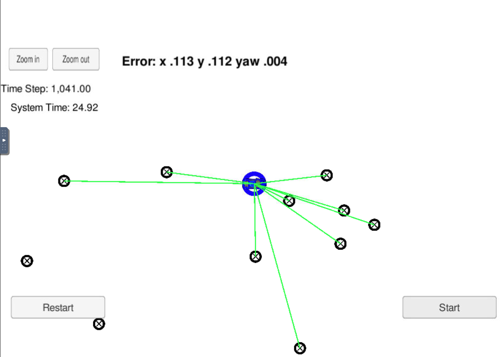](https://www.youtube.com/watch?v=PxBrMSjaFcE&feature=youtu.be)

## Project Introduction
Your robot has been kidnapped and transported to a new location! Luckily it has a map of this location, a (noisy) GPS estimate of its initial location, and lots of (noisy) sensor and control data.

In this project I implemented a 2 dimensional particle filter in C++. My particle filter will be given a map and some initial localization information (analogous to what a GPS would provide). At each time step your filter will also get observation and control data.

## Running the Code
This project involves the Term 2 Simulator which can be downloaded [here](https://github.com/udacity/self-driving-car-sim/releases)

This repository includes two files that can be used to set up and install uWebSocketIO for either Linux or Mac systems. For windows you can use either Docker, VMware, or even Windows 10 Bash on Ubuntu to install uWebSocketIO.

Once the install for uWebSocketIO is complete, the main program can be built and ran by doing the following from the project top directory.

1. mkdir build
2. cd build
3. cmake ..
4. make
5. ./particle_filter

Alternatively some scripts have been included to streamline this process, these can be leveraged by executing the following in the top directory of the project:

1. ./clean.sh
2. ./build.sh
3. ./run.sh

Tips for setting up your environment can be found [here](https://classroom.udacity.com/nanodegrees/nd013/parts/40f38239-66b6-46ec-ae68-03afd8a601c8/modules/0949fca6-b379-42af-a919-ee50aa304e6a/lessons/f758c44c-5e40-4e01-93b5-1a82aa4e044f/concepts/23d376c7-0195-4276-bdf0-e02f1f3c665d)

INPUT: values provided by the simulator to the c++ program

// sense noisy position data from the simulator

["sense_x"]

["sense_y"]

["sense_theta"]

// get the previous velocity and yaw rate to predict the particle's transitioned state

["previous_velocity"]

["previous_yawrate"]

// receive noisy observation data from the simulator, in a respective list of x/y values

["sense_observations_x"]

["sense_observations_y"]


OUTPUT: values provided by the c++ program to the simulator

// best particle values used for calculating the error evaluation

["best_particle_x"]

["best_particle_y"]

["best_particle_theta"]

//Optional message data used for debugging particle's sensing and associations

// for respective (x,y) sensed positions ID label

["best_particle_associations"]

// for respective (x,y) sensed positions

["best_particle_sense_x"] <= list of sensed x positions

["best_particle_sense_y"] <= list of sensed y positions


Your job is to build out the methods in `particle_filter.cpp` until the simulator output says:

```
Success! Your particle filter passed!
```


## Inputs to the Particle Filter
You can find the inputs to the particle filter in the `data` directory.

#### The Map*
`map_data.txt` includes the position of landmarks (in meters) on an arbitrary Cartesian coordinate system. Each row has three columns
1. x position
2. y position
3. landmark id

### All other data the simulator provides, such as observations and controls.

> * Map data provided by 3D Mapping Solutions GmbH.

## Success Criteria
If my particle filter passes the current grading code in the simulator (I can make sure you have the current version at any time by doing a `git pull`), then you should pass!

The things the grading code is looking for are:


1. **Accuracy**: my particle filter should localize vehicle position and yaw to within the values specified in the parameters `max_translation_error` and `max_yaw_error` in `src/main.cpp`.

2. **Performance**: my particle filter should complete execution within the time of 100 seconds.


# Documentation

## Localization overview
Self-driving cars use maps because these maps help them figure out what the world is supposed to look like.  
**Localization** = determining the vehicle’s precise position on the map. This involves determining where on the map the vehicle is most likely to be by matching what the vehicle sees to the map. We might identify specific landmarks — poles and mailboxes and curbs — and measure the vehicle’s distance from each, in order to estimate the vehicle’s position.  
**Markov Localization or Bayes Filter for Localization** = generalized filter for localization and all other localization approaches are realizations of this approach.  
We generally think of our vehicle location as a probability distribution, each time we move, our distribution becomes more diffuse (wider). We pass our variables (map data, observation data, and control data) into the filter to concentrate (narrow) this distribution, at each time step. Each state prior to applying the filter represents our prior and the narrowed distribution represents our Bayes’ posterior.  

### Bayes Rule
- Bayes Rule is the fundamentals of markov localisation.
- Enables us to determine the conditional probability of a state given evidence P(a|b) by relating it to the conditional probability of the evidence given the state (P(b|a) 
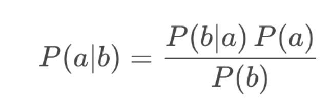

**Bayes’ Filter for Localization** =  we apply Bayes’ Rule to vehicle localization by passing variables through Bayes’ Rule for each time step, as our vehicle moves.

```cpp
With respect to localization, these terms are:
P(location|observation): This is P(a|b), the normalized probability of a position given an observation (posterior).
P(observation|location): This is P(b|a), the probability of an observation given a position (likelihood)
P(location): This is P(a), the prior probability of a position
P(observation): This is P(b), the total probability of an observation

```
**P(location)** = is determined by motion model  

### Localization Posterior  

 **bel(xt)** = estimate state beliefs  - we estimate this, without observation history.  
 This **recursive filter** is known as the **Bayes Localization filter or Markov Localization**, and enables us to avoid carrying historical observation and motion data. We will achieve this recursive state estimator using Bayes Rule, the Law of Total Probability, and the Markov Assumption.  
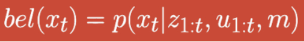


```cpp
z_{1:t} represents the observation vector from time 0 to t (range measurements, bearing, images, etc.).
u_{1:t} represents the control vector from time 0 to t (yaw/pitch/roll rates and velocities).
m represents the map (grid maps, feature maps, landmarks)
xt represents the pose (position (x,y) + orientation \θ)
```
We apply Bayes’ rule, with an additional challenge, the presence of multiple distributions on the right side (likelihood, prior, normalizing constant).  
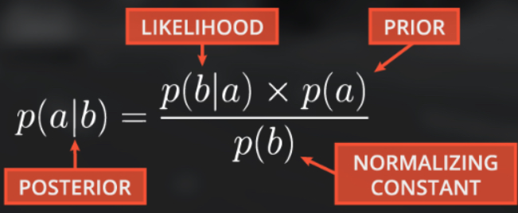

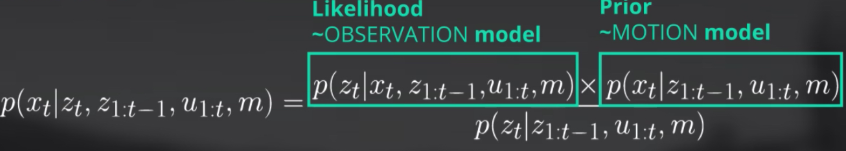

### Motion Model  

**Motion Model** = It’s a probability distribution of position set xt given the overservation z1:t-1, control u1:t and map m.
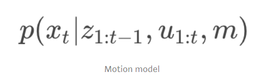

The probability returned by the motion model is the product of the transition model probability (the probability of moving from xt−1 → xt and the probability of the state xt−1.  
Now we simplify the Motion model is using Markov assumption.  
**Markov assumption** = A Markov assumption is one in which the conditional probability distribution of future states (ie the next state) is dependent only upon the current state and not on other preceding states. This can be expressed mathematically as:
P(xt​∣x_1−t,….,xt−i​,….,x0​)=P(xt​∣xt−1​)

Since we (hypothetically) know in which state the system is at time step t-1, the past observations z1:t−1​and controls u1:t−1​ would not provide us additional information to estimate the posterior for xt​, because they were already used to estimate xt−1​. This means, we can simplify p(xt​∣xt−1​,z1:t−1​,u1:t​,m) to p(xt​∣xt−1​,ut​,m).  

Since ut​ is “in the future” with reference xt−1​,ut​ does not tell us much about xt−1​. This means the term p(xt−1​∣z1:t−1​,u1:t​,m) can be simplified to p(xt−1​∣z1:t−1​,u1:t−1​,m). After applying the Markov Assumption, the term p(xt−1​∣z1:t−1​,u1:t−1​,m) describes exactly the belief at xt−1​ ! This means we achieved a recursive structure!  

We can write motion model as below:  
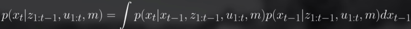

Wwe have a recursive update formula and can now use the estimated state from the previous time step to predict the current state at t. This is a critical step in a recursive Bayesian filter because it renders us independent from the entire observation and control history. Finally, we replace the integral by a sum over all xi​ because we have a discrete localization scenario in this case.
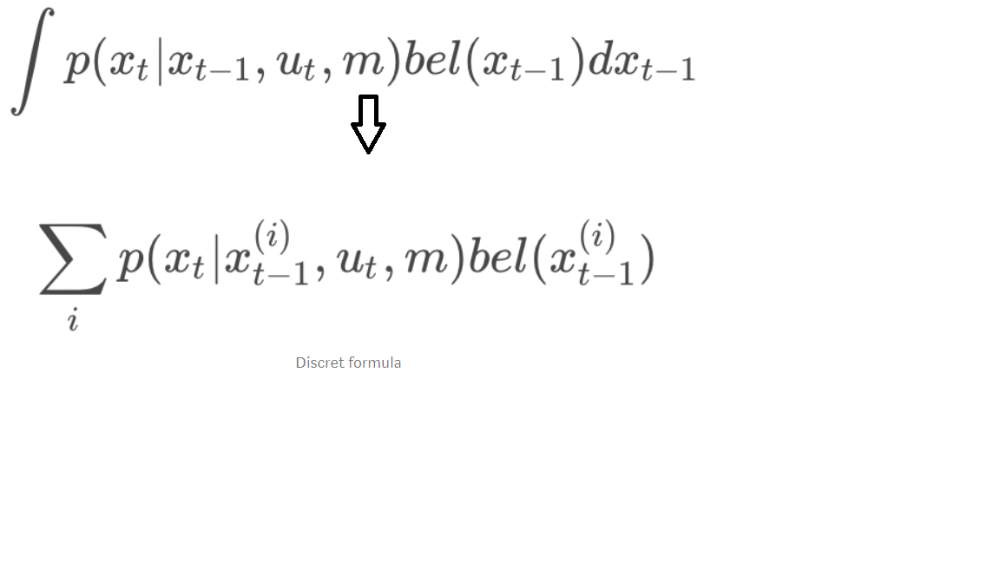

If you look at bayes rule, in order to calculate prior, we need to apply total probability.  

**The probability returned by the motion model is the product of the transition model probability (the probability of moving from xt−1 → xt and the probability of the state xt−1.**

**Example code** : go to, main.cpp  

### Observation Model

**Observation Model** = It’s a probability distribution of overservation set zt, given the position xt, observation z1:t-1, control u1:t​ and map m.  
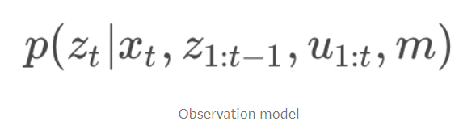
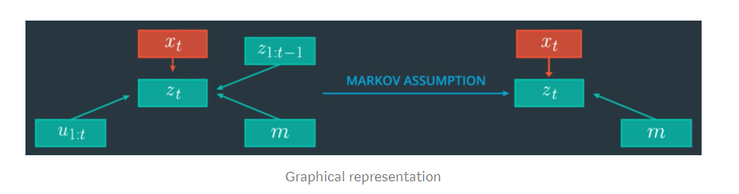


 Now we must determine how to define the observation model for a single range measurement.   
 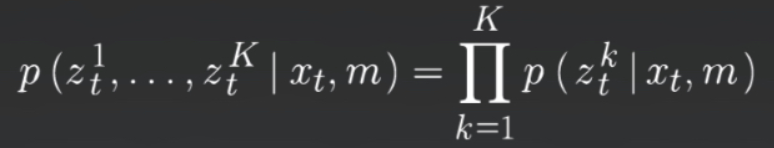  
 
 In general there exists a variety of observation models due to different sensor, sensor specific noise behavior and performance, and map types. For our 1D example we assume that our sensor measures to the n closest objects in the driving direction, which represent the landmarks on our map. We also assume that observation noise can be modeled as a Gaussian with a standard deviation of 1 meter and that our sensor can measure in a range of 0–100 meters.  
 To implement the observation model we use the given state xt​, and the given map to estimate pseudo ranges, which represent the true range values under the assumption that your car would stand at a specific position xt​, on the map.  
 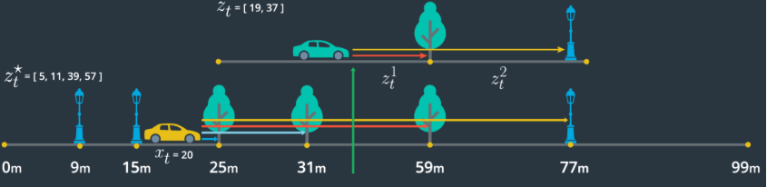
 
The observation model uses pseudo range estimates and observation measurements as inputs.
The observation model will be implemented by performing the following at each time step:

```cpp
1) Measure the range to landmarks up to 100m from the vehicle, in the driving direction (forward)
2) Estimate a pseudo range from each landmark by subtracting pseudo position from the landmark position
3) Match each pseudo range estimate to its closest observation measurement
4) For each pseudo range and observation measurement pair, calculate a probability by passing relevant values to norm_pdf: norm_pdf(observation_measurement, pseudo_range_estimate, observation_stdev)
5) Return the product of all probabilities
```

### Bayes Filter for localisation or Markov Localization full formula 

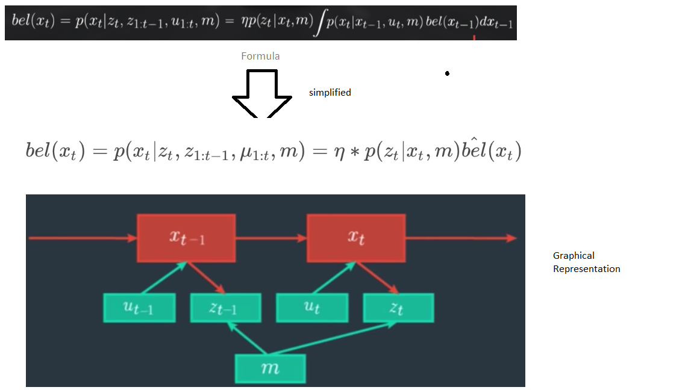
Implement the Bayes’ localization filter by first initializing priors, then doing the following within each time step:  
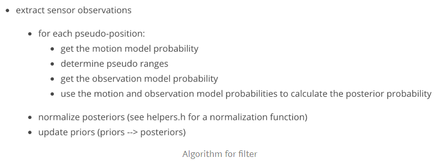

### Summary
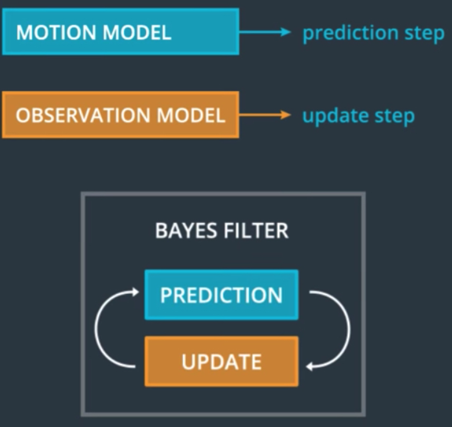
```cpp
- The Bayes Localization Filter or Markov Localization is a general framework for recursive state estimation.
- That means this framework allows us to use the previous state (state at t-1) to estimate a new state (state at t) using only current observations and controls (observations and control at t), rather than the entire data history (data from 0:t).
- The motion model describes the prediction step of the filter while the observation model is the update step.
- The state estimation using the Bayes filter is dependent upon the interaction between prediction (motion model) and update (observation model steps) and all the localization methods discussed so far are realizations of the Bayes filter eg. 1D Markov Localisation, Kalman Filters, and Particle Filters.
```

## Particle Filters overview

Particle filters are the realisation of Bayes filters or Markov localisation filter. Particle filters concepts are mainly used to solve the localisation problems.  
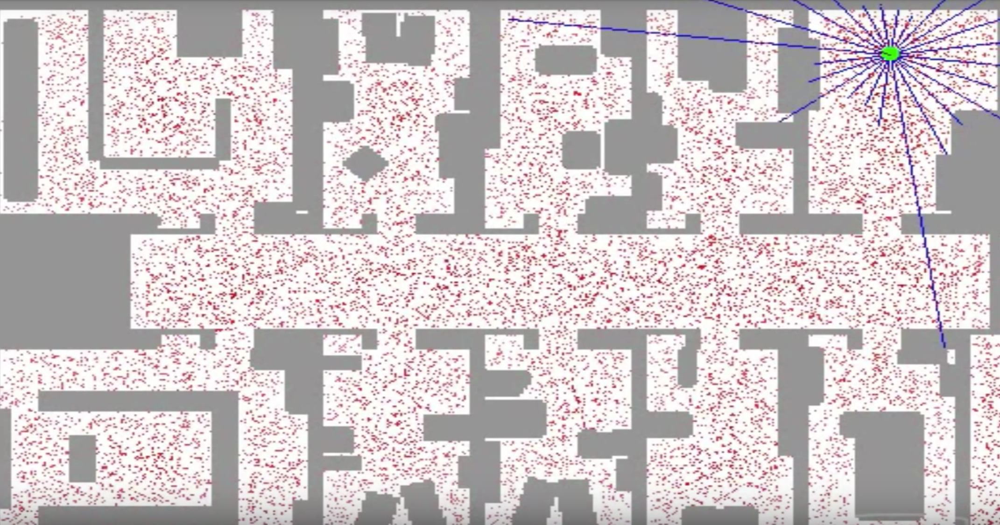  

Red dots are the discrete guesses of where the robot might be. Each red dot has x coordinates, y coordinates, and orientation. Particle filter is the set of several thousand such guesses comprise approximate representation of the posterior of the robot. In the beginning, particles are uniformly spread, but filter make them survive in proportion to how consistent is the particles with sensor measurements.

### Weights
 
Particle filter normally carry discrete no. of particles.  
**Particle** = vector which contains x coordinates, y coordinates, and orientation, which survive based on how they are consistent with sensor measurements.  
**Consistency** = measured based on mismatch between actual measurement and predicted measurement which is called weights.
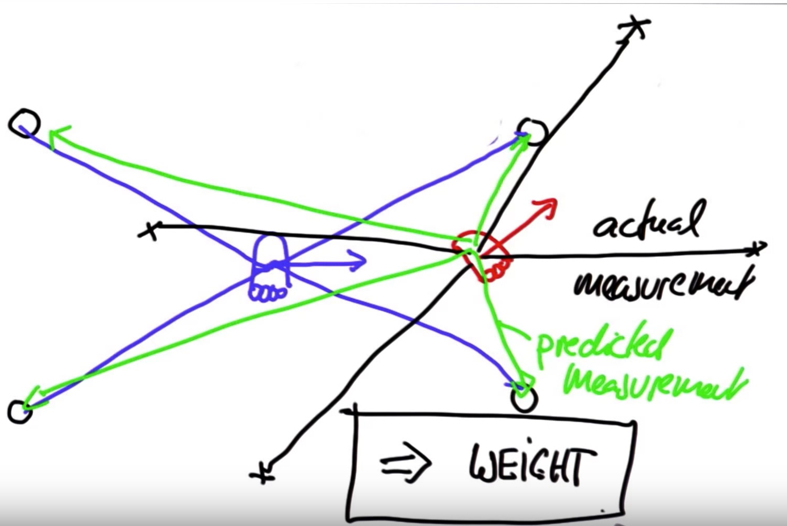 
Each weight implies how close the actual measurement of the particle to predicted measurement (higher weight particles - higher probability to survive).
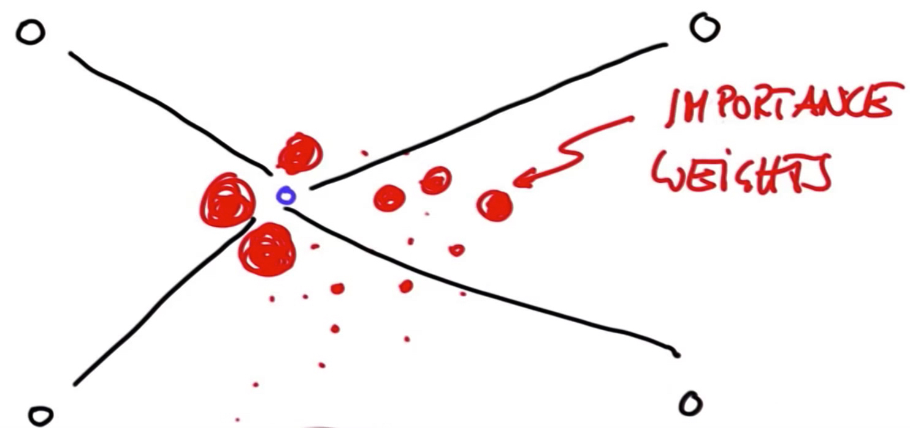

### Resampling
Technique used to randomly drawing new particles from old ones with replacement in proportion to their importance weights. After resampling, particles with higher weights likely to stay and all others may die out.  
In order to do the resampling, **Resampling Wheel** technique is used.
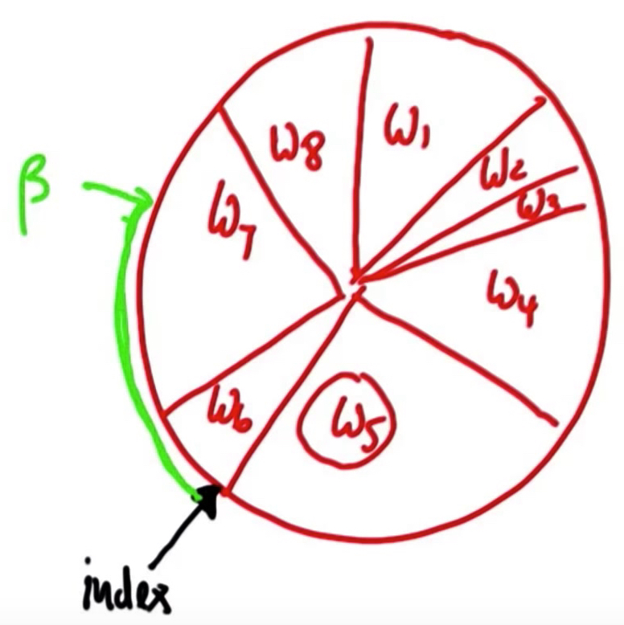

## Particle Filters implementation
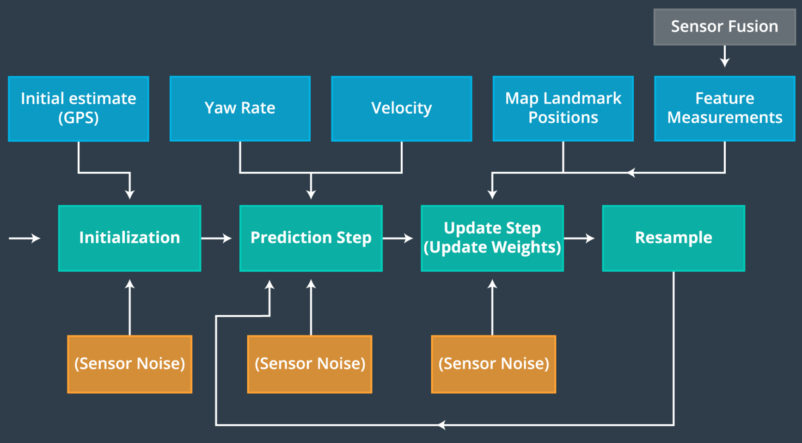
```cpp
Particle filters has got four major steps:
- Initialisation step: At the initialization step we estimate our position from GPS input. The subsequent steps in the process will refine this estimate to localize our vehicle.
- Prediction step: During the prediction step we add the control input (yaw rate & velocity) for all particles.
- Update step: During the update step, we update our particle weights using map landmark positions and feature measurements.
- Resample step: During resampling we will resample M times (M is range of 0 to length_of_particleArray) drawing a particle i (i is the particle index) proportional to its weight. Resampling wheel is used at this step.
```

###  Initialisation step
Very first thing in Particle filter is to initialise all the particles. At this step we have to decide how many particles we want to use. Generally we have to come up with a good number as it wont be too small that will prone to error or too high so that it is computationally expensive. General approach to initialisation step is to use GPS input to estimate our position.

### Prediction step
Now that we have initialized our particles it’s time to predict the vehicle’s position. Here we will use below formula to predict where the vehicle will be at the next time step, by updating based on yaw rate and velocity, while accounting for Gaussian sensor noise.
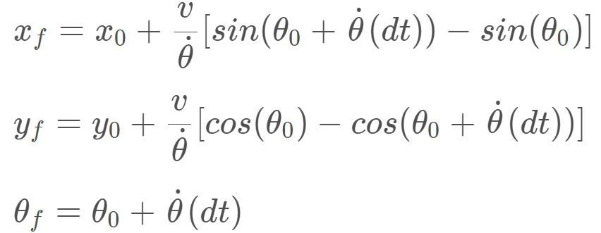

### Update step
Now that we have incorporated velocity and yaw rate measurement inputs into our filter, we must update particle weights based on LIDAR and RADAR readings of landmarks.  

```cpp
Update step has got three major steps:
1. Transformation
2. Association
3. Update Weights
```

#### 1. Transformation
We will first need to transform the car’s measurements from its local car coordinate system to the map’s coordinate system.


Observations in the car coordinate system can be transformed into map coordinates (xm​ and ym​) by passing car observation coordinates (xc​ and yc​), map particle coordinates (xp​ and yp​), and our rotation angle (-90 degrees) through a homogenous transformation matrix. This homogenous transformation matrix, shown below, performs rotation and translation.
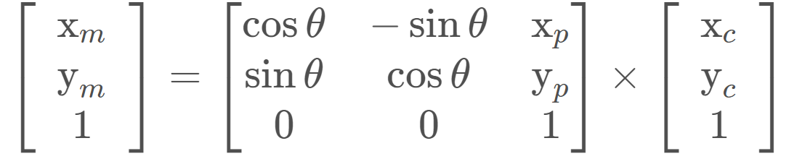

Matrix multiplication results in:
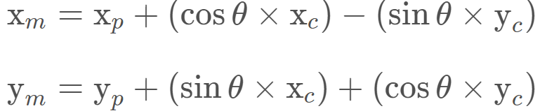

#### 2. Associations
Association is the problem of matching landmark measurement to object in the real world such as map landmarks.
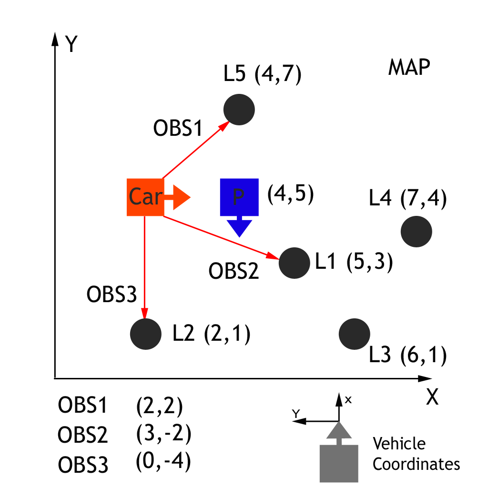

Now that observations have been transformed into the map’s coordinate space, the next step is to associate each transformed observation with a land mark identifier. In the map exercise above we have 5 total landmarks each identified as L1, L2, L3, L4, L5, and each with a known map location. We need to associate each transformed observation TOBS1, TOBS2, TOBS3 with one of these 5 identifiers. To do this we must associate the closest landmark to each transformed observation. Consider below example to explain about the data association problem.
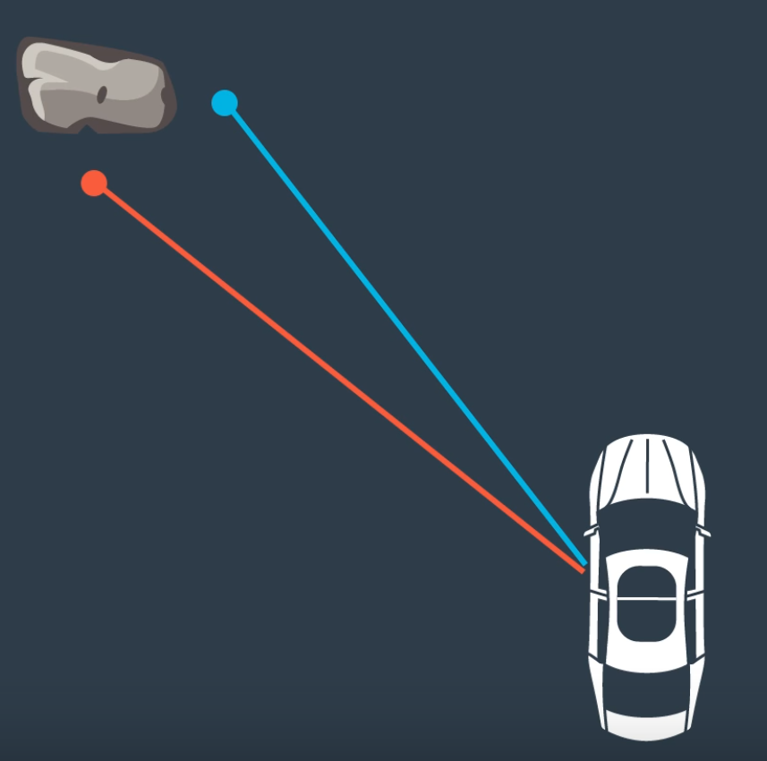

In this case, we have two Lidar measurements to the rock. We need to find which of these two measurements are corresponding to the rock. If we estimate that, any of the measurement is true, position of the car will be different based on the which measurement we picked.
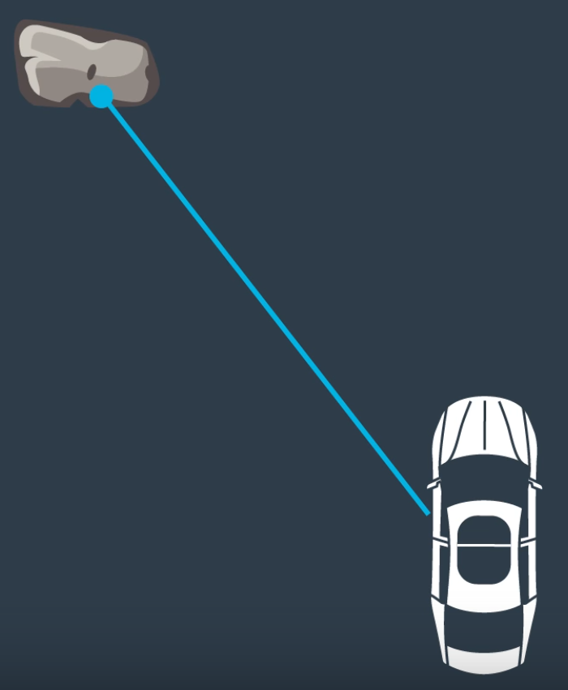

As we have multiple measurements to the landmark, we can use Nearest Neighbour technique to find the right one.
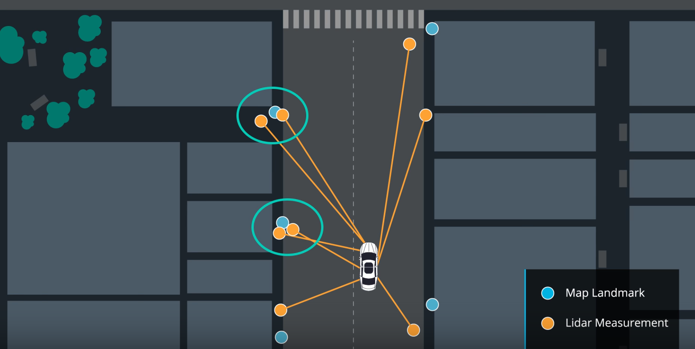

In this method, we take the closest measurement as the right measurement.
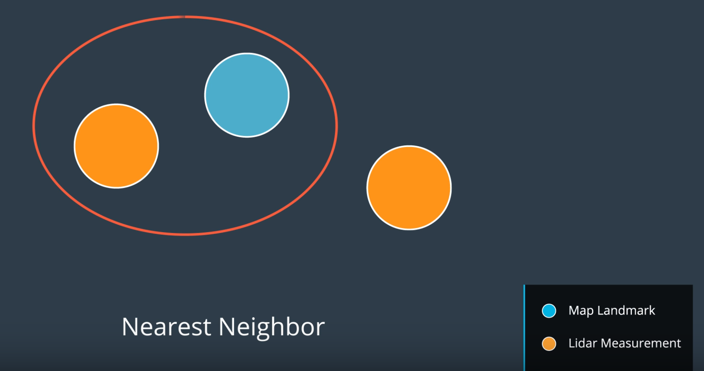

There are few pros and cons for this approach. Easy to understand and implement is the major pros of this algorithm. In terms cons, not robust to sensor noise, not robust to errors in position estimates etc.

#### 3. Update Weights
Now we that we have done the measurement transformations and associations, we have all the pieces we need to calculate the particle’s final weight. The particles final weight will be calculated as the product of each measurement’s Multivariate-Gaussian probability density. The Multivariate-Gaussian probability density has two dimensions, x and y. The mean of the Multivariate-Gaussian is the measurement’s associated landmark position and the Multivariate-Gaussian’s standard deviation is described by our initial uncertainty in the x and y ranges. The Multivariate-Gaussian is evaluated at the point of the transformed measurement’s position. The formula for the Multivariate-Gaussian can be seen below.
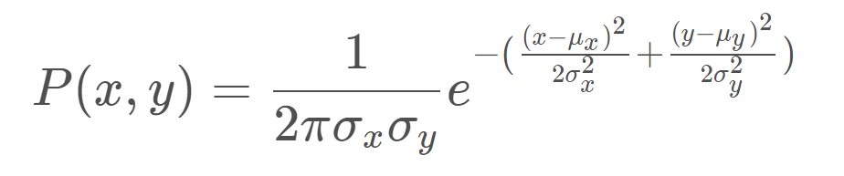

### Resample step
Resampling is the technique used to randomly drawing new particles from old ones with replacement in proportion to their importance weights. After resampling, particles with higher weights likely to stay and all others may die out. This is the final step of the Particle filter.
